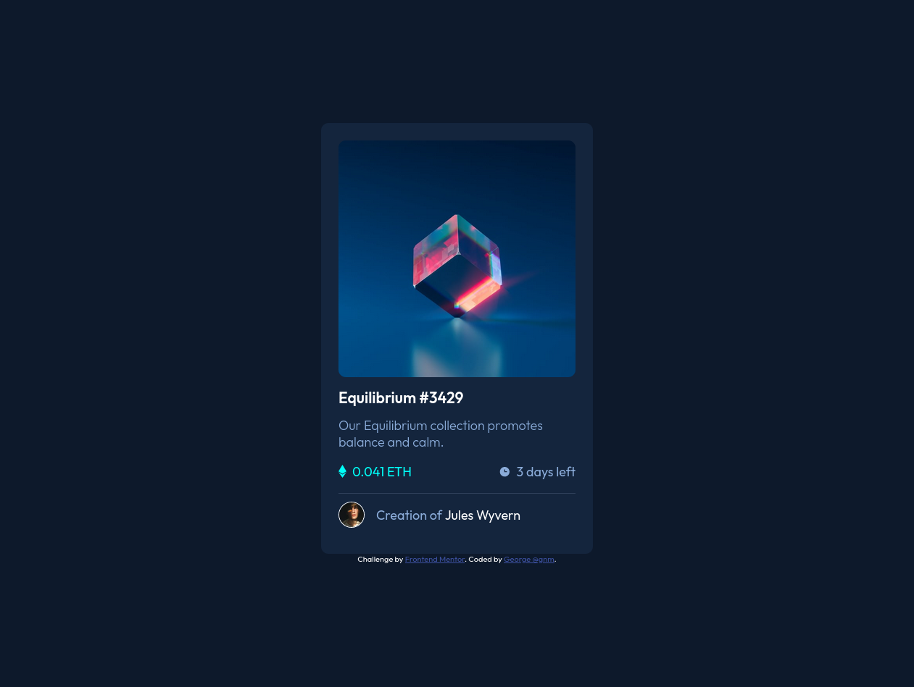

# Frontend Mentor - NFT preview card component solution

This is a solution to the [NFT preview card component challenge on Frontend Mentor](https://www.frontendmentor.io/challenges/nft-preview-card-component-SbdUL_w0U). Frontend Mentor challenges help you improve your coding skills by building realistic projects.

## Table of contents

- [Frontend Mentor - NFT preview card component solution](#frontend-mentor---nft-preview-card-component-solution)
  - [Table of contents](#table-of-contents)
  - [Overview](#overview)
    - [The challenge](#the-challenge)
    - [Screenshot](#screenshot)
    - [Links](#links)
  - [My process](#my-process)
    - [Built with](#built-with)
    - [What I learned](#what-i-learned)
  - [Author](#author)

**Note: Delete this note and update the table of contents based on what sections you keep.**

## Overview

### The challenge

Users should be able to:

-  View the optimal layout depending on their device's screen size
-  See hover states for interactive elements

### Screenshot



### Links

-  Solution URL: [Add solution URL here](https://www.frontendmentor.io/solutions/nftpreviewcardcomponentsolution-uZpEGIOOd)
-  Live Site URL: [Add live site URL here](https://g-nm.github.io/frontend_mentor/nft-preview-card-component-main/)

## My process

### Built with

-  Semantic HTML5 markup
-  CSS custom properties
-  Flexbox
-  Mobile-first workflow

### What I learned

Through this project I learned how to center elements vertically an horizontally using flexbox on the parent and a margin of auto on the children

```html
<main>
	<div class="container"></div>
</main>
```

```css
main {
	background-color: hsl(217, 54%, 11%);
	color: #fff;
	padding: 2em 0;
	min-height: 100vh;
	display: flex;
}
.container {
	width: 90%;
	max-width: 375px;
	margin: auto;
}
```

## Author

-  Frontend Mentor - [@G-nm](https://www.frontendmentor.io/profile/yourusername)
