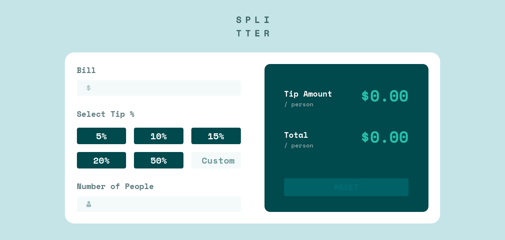

# Frontend Mentor - Tip calculator app solution

This is a solution to the [Tip calculator app challenge on Frontend Mentor](https://www.frontendmentor.io/challenges/tip-calculator-app-ugJNGbJUX). Frontend Mentor challenges help you improve your coding skills by building realistic projects.

## Table of contents

- [Frontend Mentor - Tip calculator app solution](#frontend-mentor---tip-calculator-app-solution)
  - [Table of contents](#table-of-contents)
  - [Overview](#overview)
    - [The challenge](#the-challenge)
    - [Screenshot](#screenshot)
    - [Links](#links)
  - [My process](#my-process)
    - [Built with](#built-with)
    - [What I learned](#what-i-learned)
  - [Author](#author)

## Overview

### The challenge

Users should be able to:

-  View the optimal layout for the app depending on their device's screen size
-  See hover states for all interactive elements on the page
-  Calculate the correct tip and total cost of the bill per person

### Screenshot



### Links

-  Solution URL: [Solution URL here](https://www.frontendmentor.io/solutions/tip-calculator-using-scss-grid-andmobile-first-design-2seCauDqX)
-  Live Site URL: [Live site URL here](https://reverent-liskov-dc2934.netlify.app/)

## My process

### Built with

-  Semantic HTML5 markup
-  CSS custom properties
-  Flexbox
-  CSS Grid
-  Mobile-first workflow

### What I learned

-  Through this challenge I learned about the blur event listener and how to use it to verify form values
-  I was also able to learn how to set alerts using the aria-live attribute and setting the aria-describedby property to the element showing the error

```html
<span id="bill__amount-alert" aria-live="assertive" class="alert"></span>
<input
	type="number"
	step="0.01"
	id="bill__amount"
	class="bill__amount"
	required
	aria-describedby="bill__amount-alert"
	min="1"
	name="bill__amount"
	autocomplete="off"
/>
```

## Author

-  Frontend Mentor - [@G-nm](https://www.frontendmentor.io/profile/G-nm)
